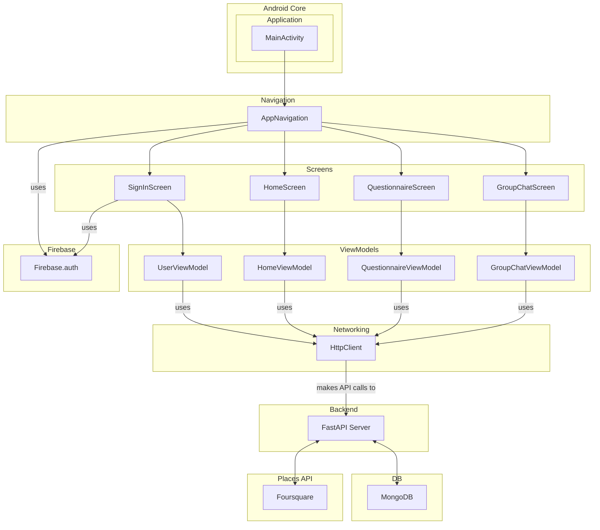

# 🍽️ DineMateApp

**An AI-powered group dining recommendation platform that learns from conversations to suggest perfect restaurants for groups.**

## 🚀 Getting Started

1.  **Clone the repository:**
    *   `git clone https://github.com/vikrant-69/DinemateApp.git`
    *   `cd DinemateApp`
2.  **Firebase Setup:**
    *   Create a Firebase project at [https://console.firebase.google.com/](https://console.firebase.google.com/).
    *   Add an Android app to your Firebase project with the package name `com.hackathon.dinemate`.
    *   Download the `google-services.json` file and place it in the `app` directory of your Android project.
    *   Enable the Google sign-in method in Firebase Authentication.
3.  **Setup Backend Server:**
    *   Follow setup instructions mentioned here: [Server setup](https://github.com/kanishkaditya/DinemateBackend?tab=readme-ov-file#-quick-start)
    *   Add the server URL in `config/AppConfig.kt`
4.  **Build and Run:**
    *   Open the project in Android Studio.
    *   Let Android Studio download the necessary dependencies.
    *   Build and run the application on an Android emulator or physical device.

## 🏗️ Navigation Flow

